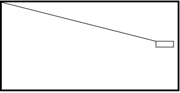

# Coding behind the scenes

This repository contains all the projects I've developed in [my Twitch show](https://twitch.tv/voscarmv). Watch [the intro video](https://www.youtube.com/watch?v=wNrfZAZCe6I) for an explenation about the inspiration and motivation behind the show (please disregard the robot voice 🤖).

## Episode 1: Drawing a line

In this episode I explored a way to draw a line on an HTML5 canvas using the mouse position. Watch the video [here](https://www.twitch.tv/videos/593304668). You can check out the [source code](/connected_lines/lines.html) and the [live demo](https://rawcdn.githack.com/voscarmv/coding_behind_the_scenes/032a9f7bff2484c4c6505845784457cf3b309568/connected_lines/lines.html) if you like.

