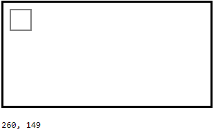
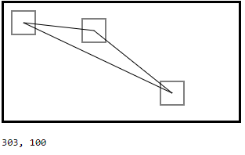
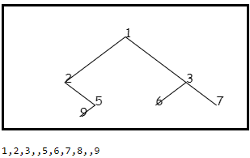

# Coding behind the scenes

This repository contains all the projects I've developed in [my Twitch show](https://twitch.tv/voscarmv). Watch [the intro video](https://www.youtube.com/watch?v=wNrfZAZCe6I) for an explenation about the inspiration and motivation behind the show (please disregard the robot voice 🤖).

## Episode 1: Drawing a line

In this episode I explored a way to draw a line on an HTML5 canvas using the mouse position. Watch the video [here](https://www.twitch.tv/videos/593304668). You can check out the [source code](https://github.com/voscarmv/coding_behind_the_scenes/blob/57dcfb1b5be81ee121fb3d2926a734dab32662c7/connected_lines/lines.html) and the [live demo](https://rawcdn.githack.com/voscarmv/coding_behind_the_scenes/032a9f7bff2484c4c6505845784457cf3b309568/connected_lines/lines.html) if you like.

## Episode 2: Drag and drop

In this episode I created a square object on a canvas and was able to implement drag-and-drop functionality for it. Watch the video [here](https://www.twitch.tv/videos/595206713). You can check out the [source code](https://github.com/voscarmv/coding_behind_the_scenes/blob/d1773ca7baa118c90d8638e617c101a22080fae8/connected_lines/lines.html) and the [live demo](https://rawcdn.githack.com/voscarmv/coding_behind_the_scenes/d1773ca7baa118c90d8638e617c101a22080fae8/connected_lines/lines.html) if you like.

## Episode 3: Connecting lines

In this episode I enhanced the Square class from the previous one, and added the Line class. Now I can connect several Square objects with Line objects, and drag-and-drop them around the canvas. Watch the video [here](https://www.twitch.tv/videos/596220515) You can check out the [source code](https://github.com/voscarmv/coding_behind_the_scenes/blob/a8a73fa3a4aa67102bbafb772950c37175b17351/connected_lines/lines.html) and the [live demo](https://rawcdn.githack.com/voscarmv/coding_behind_the_scenes/a8a73fa3a4aa67102bbafb772950c37175b17351/connected_lines/lines.html) if you like.

## Episode 4: Binary tree

In this episode I developed an algorithm to recursively draw a binary tree from an array. Watch the video [here](https://www.twitch.tv/videos/596220515) You can check out the [source code](https://github.com/voscarmv/coding_behind_the_scenes/blob/a8a73fa3a4aa67102bbafb772950c37175b17351/binary_tree/tree.html) and the [live demo](https://rawcdn.githack.com/voscarmv/coding_behind_the_scenes/a8a73fa3a4aa67102bbafb772950c37175b17351/binary_tree/tree.html) if you like.

